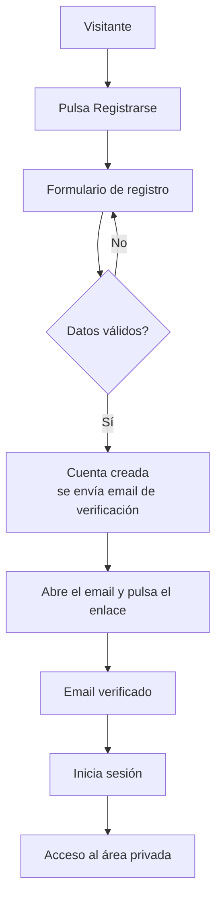
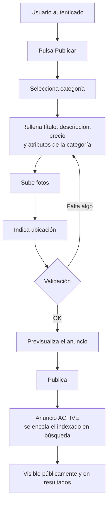
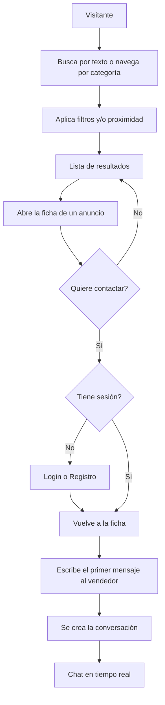
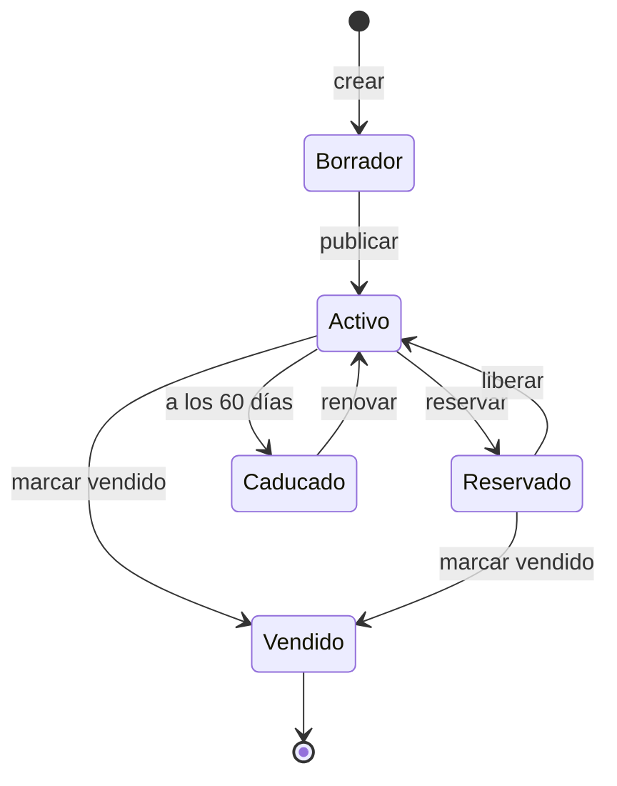

# Mapa de pantallas y flujos de usuario — MVP

> **HISTÓRICO — MVP completado (fases 0-5)**
> Este documento recoge el diseño de pantallas y flujos previo a la implementación.
> El estado real implementado está en `docs/estado-tecnico.md`.
> Plan vigente: `docs/Hoja_de_ruta_rafagas_Hito5-9.docx`; pendientes: `docs/pendientes.md`.
>
> **Corrección de regla de negocio (auditoría 2026-08-04).** La versión anterior afirmaba en
> §2.3 que «no se muestran teléfono ni email» como *regla confirmada*. **Esa regla está
> derogada** y se ha corregido en su sitio: hoy el vendedor puede publicar un teléfono
> opcional. Se corrige en vez de tacharse porque una regla derogada dentro de un documento
> histórico se sigue leyendo como regla vigente.
>
> **Otras desviaciones sabidas, no corregidas** (el documento es la foto del MVP, y como tal
> se conserva): el ciclo de vida del anuncio (§3) creció después con `PAUSED` y `ARCHIVED`, y
> el paso a vendido ya no es `POST /listings/:id/sold` sino la declaración de un `Deal`.

> **Alcance:** pantallas y flujos del MVP (fases 0-5). Las rutas coinciden con los
> route groups de Next.js definidos en la estructura del frontend. Este documento
> es el punto de partida estructural; el siguiente nivel de detalle serían los
> wireframes de baja fidelidad de cada pantalla.

## 1. Mapa de pantallas

### Públicas — sin sesión, renderizadas en servidor (SEO)

| Pantalla | Ruta | Propósito |
|---|---|---|
| Home | `/` | Portada: buscador principal, categorías destacadas, anuncios recientes |
| Listado por categoría | `/[categoria]` | Anuncios de una categoría, con filtros propios de la categoría |
| Resultados de búsqueda | `/busqueda` | Resultados por texto con filtros, facetas y proximidad |
| Ficha de anuncio | `/anuncio/[slug]` | Detalle completo, galería de fotos, ubicación aproximada, botón de contacto |
| Perfil público de vendedor | `/vendedor/[slug]` | Datos básicos del vendedor y sus anuncios activos |

### Autenticación — client-side

| Pantalla | Ruta | Propósito |
|---|---|---|
| Inicio de sesión | `/login` | Acceso con email y contraseña |
| Registro | `/registro` | Alta de cuenta nueva |
| Verificar email | `/verificar-email` | Confirmación del email tras el registro |
| Recuperar contraseña | `/recuperar` | Solicitud del enlace de restablecimiento |
| Restablecer contraseña | `/restablecer` | Definir nueva contraseña desde el enlace |

### Área privada — requiere sesión

| Pantalla | Ruta | Propósito |
|---|---|---|
| Mis anuncios | `/mis-anuncios` | Gestión de los anuncios propios y sus estados |
| Publicar anuncio | `/publicar` | Formulario de creación de anuncio |
| Editar anuncio | `/mis-anuncios/[id]/editar` | Edición de un anuncio propio |
| Mis conversaciones | `/mensajes` | Bandeja de conversaciones |
| Chat | `/mensajes/[id]` | Conversación en tiempo real con la otra parte |
| Mi perfil | `/perfil` | Datos y ajustes de la cuenta |

---

## 2. Flujos de usuario

### 2.1 Registro y verificación

El usuario no puede publicar ni contactar hasta verificar el email (regla de negocio confirmada).

### 2.2 Publicar un anuncio

Los atributos del formulario se generan a partir del `attributeSchema` de la categoría elegida.

### 2.3 Buscar y contactar

El contacto **principal** es por mensajería interna. **Además**, el vendedor puede publicar un
teléfono opcional (`Listing.phone`, distinto de `User.phone`, que sigue siendo privado): se publica
solo tras confirmación explícita del usuario, nunca viaja en el payload público de la ficha —
`findBySlug` lo descarta antes de cachear y expone solo `hasPhone: boolean`— y el número real se
sirve únicamente por `GET /listings/:id/phone`, autenticado y con rate limit (30/h por usuario,
60/h por IP). El email **nunca** se muestra. Ver «Teléfono en anuncios + Compartir anuncio» en
`estado-tecnico.md` §2.

> *Regla original de este documento, hoy derogada: «El contacto es siempre por mensajería interna;*
> *no se muestran teléfono ni email (regla confirmada)». Se mantiene aquí solo como registro del*
> *diseño del MVP; la regla vigente es la del párrafo anterior.*

---

## 3. Ciclo de vida del anuncio

Refleja los estados y reglas confirmados (caducidad a 60 días renovable; solo los `Activo` aparecen en la búsqueda).

---

## 4. Notas de diseño

- **Mobile-first:** la mayoría del tráfico de un marketplace es móvil; diseña primero para pantalla pequeña.
- **Estados vacíos:** previstos para «sin resultados» en búsqueda, «aún no tienes anuncios» y «sin conversaciones», con una llamada a la acción clara.
- **Públicas optimizadas para SEO:** home, listados y fichas renderizadas en servidor, con títulos y metadatos por anuncio.
- **Privacidad de la ubicación:** en la ficha se muestra la zona aproximada, no la dirección exacta.
- **Mínima fricción al contactar:** si un visitante sin sesión intenta contactar, se le pide registro y se le devuelve a la ficha para no perder el contexto.

## 5. Siguiente nivel (cuando lo abordes)

Wireframes de baja fidelidad de las pantallas de mayor peso —home, ficha de anuncio, formulario de publicación y resultados de búsqueda—, y un par de personas y escenarios que guíen las decisiones de prioridad visual. Es el paso natural de tu metodología de diseño centrado en el usuario sobre este esqueleto.
